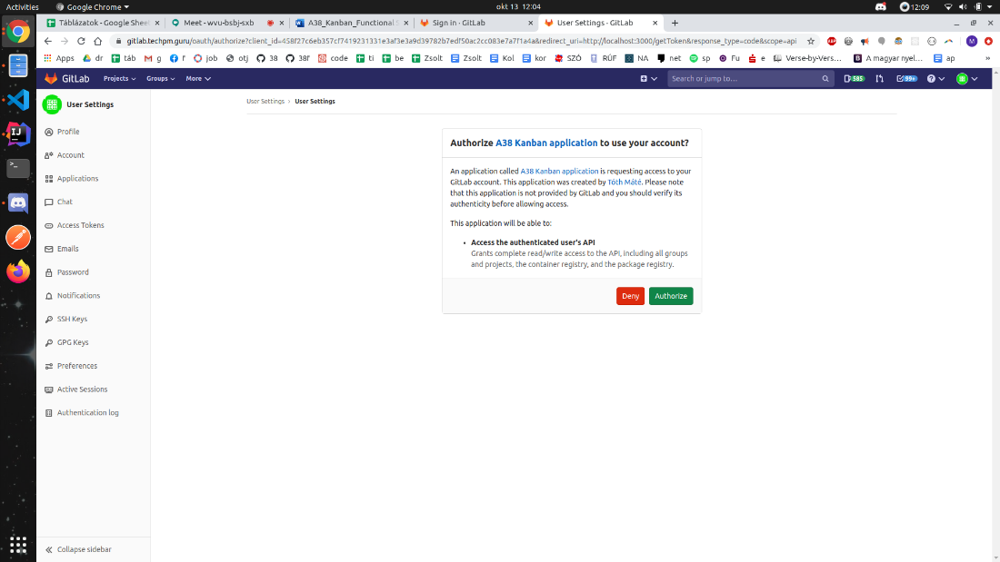
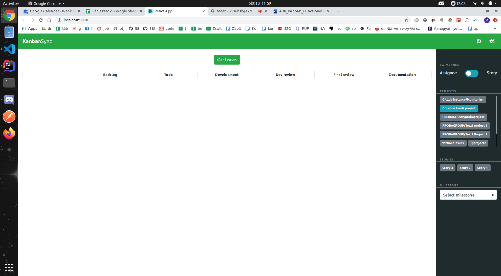
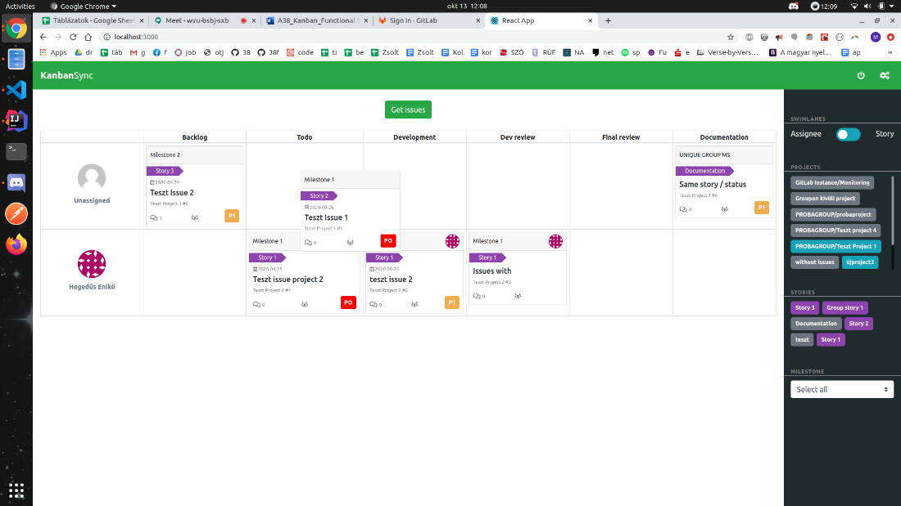

Codecool IRL Simulation

\<IT-PM Course\>

Functional Specification Document

\<A38 Ship Gitlab Kanban Board\>

Document Version: v1.0

Date: 2020.10.12

**AUTHORS**

| **Name**        | **Role**        | **Department** |
|-----------------|-----------------|----------------|
| Csapó Krisztián | Project manager | IT             |
|                 |                 |                |
|                 |                 |                |

**DOCUMENT HISTORY**

| **Date**   | **Version** | **Document Revision Description** | **Document Author** |
|------------|-------------|-----------------------------------|---------------------|
| 12.10.2020 | v1.0        | Initial Relase                    | Csapó Krisztián     |
|            |             |                                   |                     |
|            |             |                                   |                     |
|            |             |                                   |                     |
|            |             |                                   |                     |

*APPROVALS*

| **Approval Date** | **Approved Version** | **Approver Role** | **Approver** |
|-------------------|----------------------|-------------------|--------------|
| 14.10.2020        | v1.0                 | Customer          | Daher Gábor  |
|                   |                      |                   |              |
|                   |                      |                   |              |
|                   |                      |                   |              |

## 1.0 Related documents

| **Component**            | **Name (with link to the document)**                                                                              | **Description**              |
|--------------------------|-------------------------------------------------------------------------------------------------------------------|------------------------------|
| Wireframe                | [A38 Kanban Board WF](https://cacoo.com/diagrams/Pr0u9X5VB8SVhyrK)                                                | Final Edition                |
| Jira issue tracker       | [Jira](https://csapokrisztianpm.atlassian.net/jira/software/projects/AKBD/boards/3)                               | Issue tracker                |
| Trello – Product Backlog | [Backlog table](https://trello.com/invite/b/NPlC9m9L/4d644cef077b307fb43390ebbbe845e0/a38-kanban-product-backlog) | Issue tracker - User storyes |
| Trello – Development     | [Development table](https://trello.com/invite/b/H3URk4am/73404e75d82680d6f1cf0f6006a5840f/a38-kanban-development) | Issue tracker - Tasks        |
| GitHub Repo1             | [Repository](https://github.com/CsapoKrisztian/A38-Kanban-development)                                            | Contact to get invite        |
| GitHub Repo2             | [Frontend Repository](https://github.com/CsapoKrisztian/A38-Kanban-development-Frontend)                          | Contact to get invite        |

## Purpose of document

The Functional Specification Document is a document that provides detailed
information on *how* the system solution will function and the requested
behavior. This document is created based on the **high-level requirements
identified in the Business Requirements Document and provides traceability** on
the functional specifications back to the business requirements. Included in
this document will be the detailed functional requirements, including use cases,
system inputs and outputs, process flows, diagrams, and mock-ups.

## 1.2 Risks and Assumptions

-   Time till the delivery is concise. (The release date is 2020.10.13.)

-   We can not have server, so can not made full QA tests. A lot of bugs may be
    left behind.

-   This product may not be popular. The budget is strait.

-   The developer team and the Project managers are „junior team.” If the
    development does not work as well, the board will not go up till 2020.10.13.

## 1.3 System / Solution Overview

With the help of this webpage, our client (A 38 ship) can replace his old and
slow Kanban board.

The buyer is going to transfer the exact price to our company (Csapó Krisztián)
in 30 calendar days, as it is stated in the agreement. Csapó Krisztián will pay
the team mates.

## 1.4 Project Scope

**Goals of the project:**

\-The purpose of the project is to create a Kanban board, which is specialized
to our customer’s Gitlab server, to track their issues.

-   The Functional specification written when at the last sprint.

-   Wire Frame need to be detailed.

-   Create brand new Kanban Board in three sprints which can replace the
    previous version.

## 1.4.1 Deliverables and Features

## 1.4.1.1 Deliverables:

**Classic Kanban Board with filter menu.**

Hand to the customer following till the final date: 13.10.2020

Working and useable Kanban Board. With Frontend, tunneling backend. login
feature.

The webshop site contains the following functions:

-   Kanban board frontent

-   Tunneling backend with Pagination

-   Filter menu (Contain: Assignee or Story, Milestone, Stories, Projects)

-   Login feature, authenticating with Gitlab

-   User or Story Column

-   Other standard columns: Backlog, Todo, Development, Dev review, Final
    review, Documentation

-   Direct link to the gitlab issue on the Kanban cards

-   Drag&Drop function for the status change

-   Use GraphQL API for speed up

## 1.4.1.1.1 Iterations and process:

The project management team choose the type of “**Scrum**” project management
type.

The Project manager team keeps in contact with the customer. Based on time
management.

The project team will keep the following Scrum ceremonies: **Sprint Planning,
Daily Standup, Retrospective.**

The project team will show a demo to the customer every end of the sprints.

Developer team must commit to self-test (unit test) and review eachother codes.

## 1.4.1.2 Features:

-   Kanban board frontent

-   Tunneling backend with Pagination

-   Filter menu (Contain: Assignee or Story, Milestone, Stories, Projects)

-   Login feature, authenticating with Gitlab

-   User or Story Column

-   Other standard columns: Backlog, Todo, Development, Dev review, Final
    review, Documentation

-   Direct link to the gitlab issue on the Kanban cards

-   Drag&Drop function for the status change

-   Use GraphQL API for speed up

## 1.5 Functional Requirements

In the developing process we used the following technologies:

-   Backend:

    -   Java

    -   Spring

    -   GraphQL API

    -   OAuth

-   Frontend:

    -   React

    -   Axios

    -   Bootstrap

    -   Styled components

## 1.6 Use case

## 1.6.1 Login function

## 1.6.1.1 Gitlab authentication

## [./media/image1.png](./media/image1.png)

You will be automatically redirected to the GitLab server where you have to sign
in.

You will be asked to Authorize the application.

After this you will be redirected to the kanban application.

In case you are already signed in, this process will be automatically skipped.

## 1.6.2 Filter Menu

After you logged in, you have to click the “gear wheal” icon to see the filter
menu.

-   You can filter by Assignee or Story. Then you have to choose projects,
    Storyes and Milestone.

-   You can choose more than one from the Projects and Storyes too.

-   To finish the filtering process click to Get issues button.

## 1.6.3 Kanban board functions

After click to Get issues button issues will show up.

You can see the unassigned issues and Assigned issues too.

-   You can click to gitlab icon to redirect to gitlab and edit the issue.

-   You can see: Priority labels, comments, Story labels, Milestones, Issue
    name, Due date.

## 1.6.4 Drag&Drop

-   With Drag&Drop function you can change issues status by moving from column
    to column.

## 1.7 System Configurations

**Link to the** [Readme
file](https://github.com/CsapoKrisztian/A38-Kanban-development/blob/master/README.md)

## Docker deployment

prerequisite:

-   freshly built jar file has to accessible under target/\*.jar  
    You can have it by running mvn clean install

-   docker installed (<https://docs.docker.com/engine/install/>)

-   docker-compose installed (<https://docs.docker.com/compose/install/>)

-   frontend has to accessible under A38-Kanban-development-Frontend/ and be on
    the same level with the current directory

If he above points are met:

-   hit docker-compose up --build this will build the docker images from the
    specified  
    docker files based on the docker-compose.yml and spin up the application
    stack.

-   Visit localhost:3000 (To change the host see the docker-compose.yml
    configuration)  
    Be amazed.

-   The --build options forces a rebuild every time it is issued. If images are
    already build simply hit docker-compose up

If you want to run the docker compose process in the background just pass
the -d option to docker-compose

## [./media/image6.png](./media/image6.png)

1.8 Wireframe

## 2.0 Project team

| **Name**        | **Role**             | **Department** |
|-----------------|----------------------|----------------|
| Csapó Krisztián | Project manager      | IT-PM          |
| Csürke Gábor    | Project manager      | IT-PM          |
| György Noémi    | Full stack Developer | IT-Dev         |
| Hegedüs Enikő   | Full stack Developer | IT-Dev         |
| Tóth Lajos Máté | Full stack Developer | IT-Dev         |
